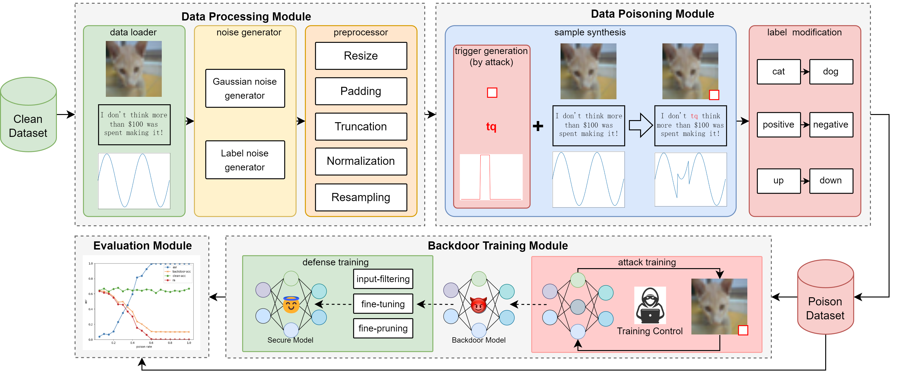

# BackdoorMBTI

This is an official implentation of the paper [BackdoorMBTI: A Backdoor Learning Multimodal Benchmark Tool Kit for Backdoor Defense Evaluation](https://arxiv.org/pdf/2411.11006). This paper has been accepted by KDD 2025 ADS track. MBTI is an open source project expanding the unimodal backdoor learning to a multimodal context, designed to easily accommodate **new and realistic scenarios and tasks**.

## Usage

see our documents: https://backdoormbti.readthedocs.io/

## Results
Part of the experimental results can be found in: [results.md](./backdoormbti/resources/results.md)
The experiments (the results will be updated once the experiment finished):
   - The performance exploration under different **clean model accuracy**
   - The performance exploration under different **poison ratio**
   - The performance exploration under different **noise level**

## Citation
If our work is userful for your research, please cite our paper as follows:
```
@inproceedings{yu2025backdoormbti,
  title={BackdoorMBTI: A Backdoor Learning Multimodal Benchmark Tool Kit for Backdoor Defense Evaluation},
  author={Yu, Haiyang and Xie, Tian and Gui, Jiaping and Wang, Pengyang and Yi, Ping and Wu, Yue},
  booktitle={Proceedings of the 31th ACM SIGKDD Conference on Knowledge Discovery and Data Mining},
  year={2025}
}


## Updates 

### 2025-06-30

1. Update the docs.
2. Fix bug of args name in atk_train.
3. Update the link in `README.md`.
4. Format using black.

### 2024-12-11
We are actively developing BackdoorMBTI with exciting new features recently added:

1. **Tasks/Modalities**: we have added 2 new type of tasks (video and contrasive learning), we are trying to support VQA task and fix the bug in R3D learning.

2. **Models**: we are now support 22 models in total (including ViT, RoBERTa, GPT2, X-Vector, HuBERT, R3D).

3. **New Attacks:** we are adding 19 attacks (9 image, 1 text, 1 audio, 4 video, 1 audiovisual, 1 contrasive learning, 2 visual question answering), see section [attacks](https://backdoormbti.readthedocs.io/en/latest/tutorials/attacks.html) for detail.

4. **New Defenses:** we have added 2 backdoor defense method (MNTD and FreeEagle), see section [defenses](https://backdoormbti.readthedocs.io/en/latest/tutorials/defenses.html) for detail.

5. **Documentation**: we have set up our documentation pages at [https://backdoormbti.readthedocs.io/](https://backdoormbti.readthedocs.io/).

6. **PyPI Package**: we have packaged BackdoorMBTI as a PyPI package for easier installation and integration.

7. **Results**: we are running serveral experiments, new results will be updated at [results.md](./backdoormbti/resources/results.md)

8. **CI Pipeline**: we have added CI pipeline for premerge test.

9. **Test Cases**: we have added first test case for BadNets.

## Future Work

BackdoorMBTI will be continuously updated to track the lastest advances of backdoor learning.
The implementations of more backdoor methods, as well as their evaluations are on the way. 
**You are welcome to contribute your backdoor methods to BackdoorMBTI.**

We have a clear roadmap for the next phases of BackdoorMBTI development, including:

1. refactoring the training pipeline and defense design, enhancing the code quality.
2. adding more test cases for high usability.
3. adding function comments for ReadTheDocs.
4. fix bug currently found (low accuracy of video training).
5. adding tasks and modalities we promised (VQA and audiovisual).

The framework:

